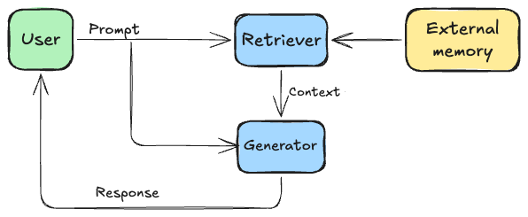
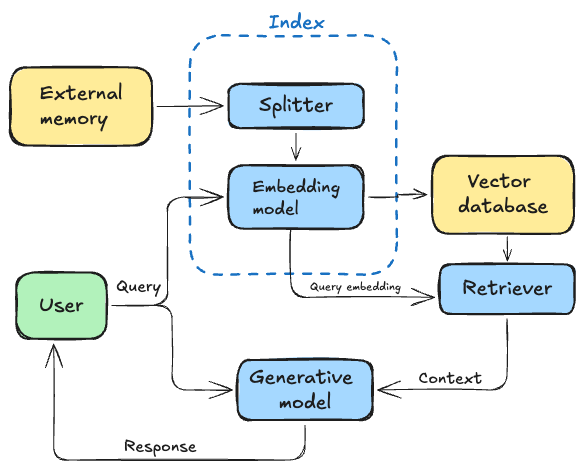
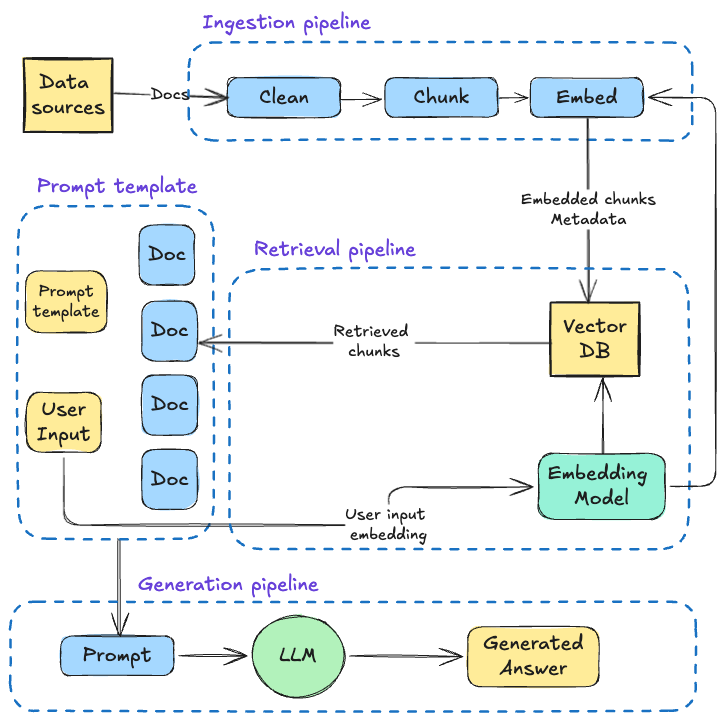

# Retrieval-Augmented Generation

**RAG** (retrieval-augmented generation) - a technique to construct context specific to each query instead of using the same context for all the queries. 
- RAG is one of the most popular applications of LLMs. 
- RAG is often used on data the LLM was't trained on, helping with hallucinations and access to old/private data. 

## RAG Architecture

**RAG components**
- Retriever - retrieves information from the external memory (e.g. search engine).
- Generator - generates a response based on the retrieved information (generative model). 



**How RAG systems work?**
Assume the external memory is a database of documents. The retriever is responsible for indexing, i.e., processing the data so that it can be quickly retrieved later. Retrieving whole documents can cause the context to be arbitrarily long so, in practice, each document is split into smaller chunks. 
For each query, we retrieve the data chunks that are the most relevant to this query and append them to the user prompt to generate the final prompt. This final prompt is then fed into the generator to get the response. 
## Retrieval algorithms

Information Retrieval (IR) - rank documents based on their relevance to a given query (search engine, recommendation system). There are two main IR categories: **keyword** and **semantic**.
### Keyword retrieval

Keyword retrieval (or term-based, lexical, etc.) works by matching the words in the query with the words in the documents:
- The more a term appears in a document, the more relevant the document is to this term. The  count is called *term frequency* (TF). 
- The more documents contain a term, the less informative this term is, i.e. the term's importance is inversely proportional to the number of documents it appears in. This number is called *inverse document frequency* (IDF).

**TF-IDF** is an algorithm that combines these two metrics to compute the score of a document $D$ given a query $Q$ as follows:
- Assume $t_1, \ldots, t_q$ are the terms of the query $Q$. 
- Given a term $t$, the frequency of the term in the document $D$ is $f(t, D)$. 
- Let $N$ be the total number of documents and $C(t)$ the number of documents containing the term $t$. The IDF of the term $t$ is computed as $$\textrm{IDF}(t)=\log\frac{N}{C(t)}.$$
- The TF-IDF score of the document $D$ with respect to the query $Q$ is defined as $$\textrm{Score}(D, Q)=\displaystyle\sum_{i=1}^{q}{f(t_i, D)\times\textrm{IDF}(t_i)}.$$
The most popular keyword retrieval solution is `Elasticsearch`. The best enterprise keyword search engine is `Algolia`. Both are based on a data structure called *inverted index* which is a mapping between terms and the documents containing them. The inverted index allows for very fast retrieval of documents given a term. 
### Semantic retrieval

Semantic retrieval (embedding-based) computes the relevance at a semantic level rather than at a lexical level (the frequency of a term doesn't necessarily captures its meaning). Semantic retrievers aim to rank documents based on how closely their meaning align with the query. In such systems, the indexing has an extra step: converting the original data chunks into embeddings and store them into a *vector database*. 



The same embedding model is used to convert both the query and the data chunks. The retriever fetches $k$ data chunks whose embeddings are closest to the query embedding. 

**Vector search** is one of the most difficult parts in a semantic retrieval system. Given a query embedding, we must find the closest vectors in the vectors database and return them, i.e., we mush perform a *nearest neighbor search*. 
The naive approach to the nearest neighbor search problem is the following:
- compute the similarity score between the query vector and all the vectors in the database (e.g. cosine similarity), 
- rank all the vectors in the database by their similarity scores, 
- return the top $k$ vectors with the highest similarity scores. 
While this approach might work for small datasets, for large datasets, vectors search is typically implemented as ANN (*approximate nearest neighbor*). The most popular (open-source) libraries implementing ANN are: 
- `FAISS` (Facebook Ai Similarity Search),
- `ScaNN` (Google's Scalable Nearest Neighbors),
- `Annoy` (Spotify's Approximate Nearest Neighbor Oh Yeah). 
### Compare retrieval algorithms

Keyword retrieval is generally much faster than semantic retrieval during both indexing and query and there are out-of-the-box solutions (`Elasticsearch`). Semantic retrieval can be significantly improved over time to outperform keyword retrieval (one can fine tune the embedding model and the retriever on domain-specific data). 
The most common metrics to evaluate RAG systems are *precision* and *recall*.
- **Precision** - Out of all the documents retrieved, what percentage is relevant to the query? 
- **Recall** - Out of all the documents that are relevant to the query, what percentage is retrieved?
Recall is usually more difficult to compute as, for a given query, we might need to annotate the relevance of all documents in the database to the query. 
Also, if the ranking of the retrieved documents matters, we can compute metrics such as **NDCG** (normalized discounted cumulative gain), **MAP** (mean average precision), and **MRR** (mean reciprocal ranking).  

|                 | Keyword retrieval                                                                            | Semantic retrieval                                                                                       |
| --------------- | -------------------------------------------------------------------------------------------- | -------------------------------------------------------------------------------------------------------- |
| **Speed**       | Much faster than semantic retrieval                                                          | Query embedding and vector search can be slow                                                            |
| **Performance** | Strong performance oob, but hard to improve<br>Can retrieve wrong docs due to term ambiguity | Can outperform keyword retrieval with finetuning <br>Allow more natural queries as it focuses on meaning |
| **Cost**        | Much cheaper than semantic retrieval                                                         | Embeddings, vector storage, and vector search can be expensive                                           |
### Hybrid search

A system combining both keyword retrieval and semantic retrieval is called *hybrid search* (and, in fact, many production retrieval systems are hybrid). Different algorithms can be used sequentially: 
- first, use a cheap, but less precise retriever to fetch a subset of candidates, 
- then, use a more precise retriever to rerank the candidates from the first step.
Also, we can use multiple retrievers to fetch candidates in parallel and then have a reranker combining all these rankings into a final one (e.g. reciprocal rank fusion). 
### Retrieval optimization

**Chunking**
The simplest strategy is to chunk documents into pieces of equal length based on a certain unit (e.g. character, word, sentence, paragraph). 
Another strategy is to split the documents recursively using increasingly smaller units until we reach the maximum chunk size. For example, start by splitting into sections, and then go to paragraphs, sentences, etc. This reduces the chance of related text being arbitrarily broken off. 
Specific documents require creative chunking strategies:
- code - special splitters for each programming language, 
- Q&A - split into question and answer pairs, etc. 
The chunk size shouldn't exceed the maximum context length of the generative model. 
Smaller chunk size allows for more diverse information as we can fit more chunks into the model's context, but can cause loss of important information. Smaller chunks also increase the computational overhead for semantic systems (more chunks to index, more embeddings to compute, increased vector search space which reduces the latency, etc.).

**Reranking**
Reranking is useful when you want to reduce the number of retrieved documents, either to fit them into the generative model's context or reduce the number of input tokens. 
The most common pattern is to use a cheap, less precise retriever to fetch candidates, followed by a more precise, more expensive mechanism to rerank the candidates. 
Documents can be also reranked based on time, e.g. for news aggregation. 

**Query rewriting**
Query rewriting is a common technique to improve the query context in retrieval systems and can be done using heuristics (search engines) or by another model (AI systems like RAG). 

**Contextual retrieval**
The idea behind contextual retrieval is to augment each chunk with relevant context to make it easier to retrieve the relevant chunks, e.g. augment chunk with keywords, metadata, entities, etc. (in e-commerce, products can be augmented with description and reviews). 
When documents get split into multiple smaller chunks, some chunks might lack the necessary global context so we can augment them with the context from the original document (title, summary).  

## Designing RAG Systems

A RAG system is composed of three main modules independent of each other:
- Ingestion pipeline - batch/streaming pipeline to populate the vector database.
- Retrieval pipeline - query the vector database to retrieve relevant entries to the user's input. 
- Generation pipeline - use the retrieved data to augment to prompt and an LLM to generate the final answer.



### Ingestion pipeline
- **Data extraction layer** - gathers data from various sources (e.g. DBs, APIs, files). 
- **Cleaning layer** - standardizes data and remove unwanted characters (e.g. non-ASCII, urls). 
- **Chunking layer** - splits the cleaned data into smaller chunks. 
- **Embedding layer** - uses an embedding model to project the chunks' content into a dense vector representation that encodes the semantic meaning. 
- **Loading layer** - takes the embedded chunks along with their metadata (text content, url, etc.) and loads them to the vector database. The embedding is used as an index to query similar chunks, while the metadata is used to access the information added to augment the prompt.

### Retrieval pipeline
The retriever takes the user's input, embeds it using the same model from the ingestion pipeline, and queries the vector database for similar vectors. The most popular similarity metric for vectors is the cosine distance. 

### Generation pipeline
The last step of a RAG system is to take the user's input, retrieve similar chunks, pass everything to an LLM, and generate the final answer. 
The final prompt results from a system and prompt template populated with the user’s query and
retrieved context. For example:

```
system_template = """
You are a helpful assistant who answers all the user's questions politely.
"""

prompt_template = """
Answer the user's question using only the provided context. If you cannot
answer using the context, respond with "I don't know."
Context: {context}
User question: {user_question}
"""
```

### Advanced RAG optimizations

A basic RAG system can be optimized at three different stages:
#### **Pre-retrieval** 
This stage focuses on how to structure and preprocess the data for index and query optimization. 
- **Sliding window chunking** - Split documents into overlapping chunks to ensure that important context near the boundaries is retained. 
- **Enhance data granularity** - Remove irrelevant details from data, verify factual accuracy, update outdated information. 
- **Metadata** - Adding metadata like dates, urls, external ids, etc. helps filter results efficiently during retrieval.
- **Optimize index structure** - Use different data index methods, various chunks sizes, multi-index strategies, etc. 
- **Small-to-big** - Decouple chunks used from retrieval and the context used in the prompt. Use a small sequence of text to generate the embedding while preserving the sequence itself and a wider window around it in the metadata. Using smaller chunks enhances the retrieval's accuracy, while the larger context adds more contextual information to the LLM. 
- **Query routing** - Used to decide what action to take based on the user's input: retrieve context from different external systems, use different query templates, etc.
- **Query rewriting** - Align the user's initial query with the way the data is structured. 
	- **Paraphrasing** - Rephrase the query while preserving its meaning.
	- **Synonym substitution** - Replace less common words by synonyms to broaden the search scope. 
	- **Sub-queries** - For longer queries, break them down into multiple shorter queries that are more focused. 
- **Hypothetical document embedding (HyDE)** - Use an LLM to create a hypothetical response to the query. Then feed both the original query and the LLM's response to the retriever. 
- **Query expansion** - Enrich the user's query by adding additional terms or concepts. 
- **Self-query** - Map unstructured queries into structured ones. Use an LLM to detect key entities, events, relationships within the input query and use them to reduce the vector search space. 
#### **Retrieval**  
This stage revolves around improving the embedding model and metadata to improve the vector search step. 
- **Instructor models** can be leveraged to improve the embeddings instead of finetuning the embedding model (which can be very expensive). 
- **Hybrid search** - Blend keyword and vector search in the retrieval step. 
- **Filtered vector search** - Use the metadata index to filter for specific words within the metadata. 
#### **Post-retrieval**  
This stage targets different ways of filtering out the noise from the retrieved documents and compress the prompt before feeding it to the LLM. 
- **Prompt compression** - Keep only the essence of the data in the final prompt. 
- **Re-ranking** - Use a cross-encoder model to compute a matching score between the user's query and the retrieve chunks and keep only the top $K$ as the most relevant. A very popular strategy is to retrieve the data using a similarity metric and then refine the retrieved chunks using a re-ranking model (which is usually more expensive and can't be used directly for retrieval). 